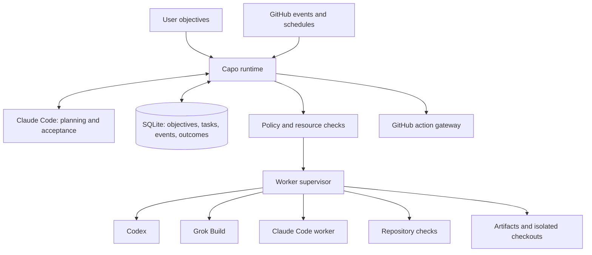

# Capo architecture

Status: proposed design, September 12, 2026. Initial domain: GitHub and project development.

## Product boundary

The user sets an objective and acceptance criteria. Claude Code is the primary decision maker: it plans, assigns work, requests corrections, and judges completion. A local Capo runtime persists those decisions and supervises execution. Codex and Grok Build are independently authenticated workers. Roles remain separate from providers.

Start with one complete workflow: take a development objective for a registered repository, inspect relevant issues and code, plan work, implement in an isolated checkout, test, independently review, revise, and prepare a pull request. Only enable external writes for categories the user has authorized. GitHub issue text and repository content are task data, not authority to change policy.

## Components



The runtime validates structured decisions before applying them. Claude cannot mark an objective complete without recorded acceptance evidence. The runtime remains alive independently of individual model sessions. If Claude is unavailable, objectives wait; substituting another CEO is a future user-configurable option.

## First workflow

1. Register an explicitly selected repository, local checkout, base branch, trusted verification commands, and permitted external actions.
2. Create an objective from a user request or an eligible GitHub issue. Store its source, acceptance criteria, and base commit.
3. Collect repository metadata and relevant source material. Claude proposes bounded tasks, dependencies, worker roles, and acceptance checks.
4. Validate the plan for cycles, missing dependencies, unavailable workers, and resource limits.
5. Create separate workspaces for independent implementation tasks. Record each starting commit; never let simultaneous workers edit one checkout.
6. Dispatch eligible tasks to providers through their supported CLI interfaces. Persist prompts, output artifacts, session IDs, exit status, and elapsed time.
7. Integrate dependent changes in an integration workspace. Run trusted checks on the actual candidate commit.
8. Give an independent reviewer the candidate diff, objective, and verification results. Return findings to the implementer within an iteration limit.
9. Claude evaluates acceptance criteria against tests, review findings, and artifacts. Exhausted retries produce a blocked objective with a concrete reason.
10. Prepare the PR title, body, branch, and diff. Publish only under the repository's configured authorization. Track CI and later revisions as additional tasks.

## Durable execution

Use SQLite with migrations, foreign keys, WAL, and transactional task claims for a single-machine deployment. A local artifact directory holds larger outputs. A later distributed deployment can migrate the same contracts to PostgreSQL and object storage.

Core records:

| Record | Required information |
| --- | --- |
| Repository | Canonical path, remote identity, base branch, trusted checks, policy reference |
| Objective | Request, source identity, status, acceptance criteria, creation time, limits |
| Task | Objective, role, provider, dependency IDs, status, workspace, acceptance criteria |
| Attempt | Task, session ID, process ownership, lease, start/end, outcome, artifact references |
| Event | Entity, event type, timestamp, version, structured payload |
| Action | Exact external operation, content digest, authorization, remote result, idempotency key |
| Outcome | Task category, provider/model/version, verification, reviewer result, latency, usage |
| Memory | Scope, statement, source, confidence, validity period, supersession |
| Skill version | Content digest, provenance, evaluations, candidate/active/retired state |

Task states: queued → running → awaiting_review → succeeded; alternative states are retry_wait, blocked, failed, and cancelled. Objective completion is a separate decision from individual task success. Preserve attempt history on retries.

Claim work transactionally and renew a lease while the supervisor owns the process. On restart, reconcile leases and live processes before retrying; never blindly duplicate an attempt. External writes require an operation identity and remote reconciliation after uncertain outcomes. A crash after publishing a PR must not create a second PR.

Cancellation terminates the process group, escalates after a grace period, and retains artifacts. Every task has a timeout and every objective has a maximum number of attempts and worker calls. Scheduling uses due times and backoff, not a model continuously polling itself.

## Provider adapters

Normalize these operations while exposing provider differences explicitly:

```text
capabilities() -> supported operations and CLI version
assign_task(task, workspace, context, limits) -> attempt handle
continue_task(handle, feedback) -> attempt handle or unsupported
get_status(handle) -> normalized status
interrupt(handle) -> termination outcome
retrieve_result(handle) -> report and artifacts
estimate_capacity() -> observation or unknown
report_usage(handle) -> measured fields with provenance
```

Use explicit session IDs when continuing work. Never use a global "most recent" session in concurrent operation. Provider exit success is necessary but insufficient: reject provider-reported errors, malformed output, and incomplete acceptance evidence.

Verified integration surfaces:

| Provider | Initial interface | Notes |
| --- | --- | --- |
| Claude Code | `claude -p --output-format json` | Structured decisions can use `--json-schema`; parse `structured_output` and provider error indicators. |
| Codex | `codex exec --json` | Read JSONL events and capture the final report; explicit session continuation is supported. |
| Grok Build | `grok -p ... --output-format json` | The installed CLI also supports `--prompt-file`; ACP is an option for a later persistent integration. |

Keep normal provider authentication inside each CLI. Do not copy subscription tokens into Capo or assume API billing is included. Verify the effective authentication mode during setup. Never silently fall back to paid API credentials. An installed executable does not establish that the account is authenticated or has remaining capacity.

CLI capabilities vary by installed version: discover flags locally, pin supported versions, and test recorded provider fixtures. On this machine the inspected versions were Claude Code 2.1.263, Codex 0.154.0, and Grok 1.0.13. No model invocation or authentication verification was performed during this inspection.

## Permissions and execution boundaries

Separate the control plane (state, policy, credentials, trusted commands) from worker-writable repositories. The CEO makes proposals; the runtime authorizes effects. A policy instruction inside a prompt is not a security boundary.

Use provider sandboxes and OS/container isolation appropriate to each adapter. Worktrees prevent edit collisions but do not isolate secrets, network access, or the shared Git directory. A worker with unrestricted shell access and inherited credentials could bypass a GitHub gateway; such a configuration cannot claim enforced external-action restrictions. Untrusted code and tests require an execution environment without publishing credentials.

Keep GitHub writes behind a gateway with narrowly scoped credentials. Authorization binds repository, operation, branch or commit, and exact content; invalidate it if the payload changes. Policy should distinguish reading, local changes, pushing branches, publishing PRs/comments, merging, releases, deletion, and spending. User-configured standing authorization avoids repeated approval for routine work.

Treat repository hooks, build scripts, MCP configuration, and downloaded skills as executable input. Load trusted configuration deliberately. Retain the provider's permissions; do not make blanket bypass flags the default.

## Routing and capacity

Start with configured preferences: Claude leads; Codex and Grok can implement and independently review each other's work. Choose a provider eligible for the task, with available concurrency and no active cooldown. Keep Claude capacity in reserve for acceptance and recovery.

Quota may be unknown. Store observed availability, observation time, source, any provider-reported reset, and confidence. Local call counts are not remaining subscription quota. On a rate-limit response, suspend that provider until the reported reset or a conservative backoff. Do not multiply concurrent calls to defeat a limit.

Track elapsed time, attempts, tests, review outcomes, and whatever usage the provider actually reports. Subscription usage, estimated token value, and actual incremental charges are distinct quantities. Early routing statistics are descriptive; learned routing needs enough comparable tasks and uncertainty estimates.

## Context and memory

Task envelopes contain only the relevant objective, repository snapshot, dependencies, source references, bounded artifacts, and acceptance criteria. Reports contain the result, changed files, checks with outcomes, unresolved findings, and artifact references. Store operational evidence rather than private model reasoning.

Begin with searchable project decisions and task outcomes. Every remembered claim needs provenance; distinguish user preferences from inferred preferences and verified facts from worker opinions. Provide correction, deletion, expiration, and project scoping. Build procedural skills from repeated successful workflows, not a single self-reported success.

## Improvement and evaluation

Record outcomes from the first release. Add routing experiments only after baseline measurements exist. Evaluate changes on held-out tasks with objective checks, not solely a model judge. Track success, user corrections, latency, retries, model calls, and incremental spend separately.

Skill and system changes are versioned candidates with evidence, reviewer identity, and rollback references. Run tests and representative historical tasks before promotion. Protect policy, credentials, budgets, evaluation data, and release authority from worker modification. A candidate cannot edit its own success criteria or approve itself.

## Delivery sequence

1. **Local vertical slice:** repository registration, objective state, Claude planning and acceptance, Codex/Grok adapters, isolated workspace, bounded retries, checks, independent review, local delivery report.
2. **GitHub operation:** issue intake, deduplication, exact-content action authorization, branch/PR publication, CI ingestion, restart recovery and cancellation.
3. **Persistent operation:** scheduler, per-provider concurrency/cooldowns, monitoring, scoped memory, recurring objectives.
4. **Measured improvement:** baseline evaluations, skill proposals, routing experiments, promotion and rollback.
5. **Broader organization:** additional domains, remote workers, nested leads, optional CEO fallback.

The complete vision is a roadmap. Do not label a prompt wrapper or fixed three-model chain as a finished autonomous operating system.

## Acceptance tests for the first release

- A small fixture repository can receive an objective and produce a verified change plus independent review through the full pipeline.
- A failing check prevents completion; reviewer findings trigger bounded revision.
- Worker timeout, malformed output, provider rate limit, and unavailable authentication produce explicit recoverable state.
- Restart does not lose tasks or launch duplicate active attempts.
- Concurrent workers cannot overwrite one another's working files.
- Disallowed external writes cannot occur through either the gateway or a worker escape path.
- No configured API spending occurs when only subscription usage is authorized.
- Tests can run against deterministic fake worker executables without consuming subscriptions; opt-in live smoke tests validate actual provider contracts separately.

## Sources

- [Claude Code programmatic usage](https://code.claude.com/docs/en/headless)
- [Codex non-interactive usage](https://developers.openai.com/codex/noninteractive)
- [Grok Build CLI reference](https://docs.x.ai/build/cli/reference)
- [Grok Build headless and scripting](https://docs.x.ai/build/cli/headless-scripting)

Provider details were checked against official documentation and local help on September 12, 2026. Architecture and sequencing above are design recommendations, not provider guarantees.
